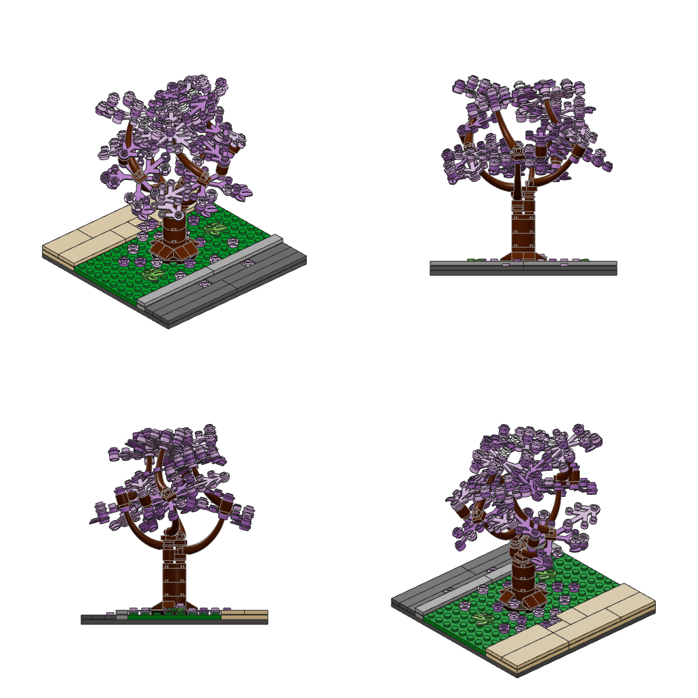

# Ficha — Jacarandá de vereda

## Especie y por qué

**Jacarandá** (*Jacaranda mimosifolia*), el árbol de las veredas de Buenos Aires en noviembre.

- **Se lee al instante.** Tiene un tronco corto que se abre en vaso en varias ramas curvas y una copa más ancha que alta, con huecos. Es la forma de árbol "tipo acacia" que la gente prefiere (Sommer y Summit; Lohr y Pearson-Mims 2006, en `hechos-arbol.md` §3).
- **Tiene un color que casi ningún árbol de ladrillos usa: lila.** Las piezas existen de verdad en esa paleta:
  - *Plant Leaves 6×5* (2417) y *4×3* (2423) salieron en Medium Lavender y Lavender.
  - *Plate 1×1 with 5 Petals* (24866) salió en Lavender, Medium Lavender y White.
- **Trae su propia historia.** Las flores caen y dejan una alfombra lila sobre el pasto, la cuneta y las baldosas. Así la base es parte del árbol y no un soporte.

## Escala

Aproximadamente **1:100**.

| | Árbol real | Modelo |
|---|---|---|
| Alto sobre el suelo | ~13 m | 329 LDU (13,2 cm) |
| Copa | ~12–15 m de ancho | ~15 studs (12 cm) de ancho y ~9 studs de alto |
| Horqueta | ~3 m | 80 LDU (3,2 cm) |
| Tronco | ~50 cm | 2×2 redondo |

- El tronco está engordado unas tres veces, para que tenga peso visual. Se afina en cuatro tallos 1×1 en la horqueta.
- Una persona mediría 1,7 cm (un ladrillo redondo 1×1 y una placa).
- La base de 16 × 16 es una tajada de calle: asfalto, cordón, franja de pasto con el árbol y baldosas.

## Rasgos que, si faltan, dejan de leerse como jacarandá

1. **Floración lila que cubre la copa.** Tiene tres tonos: el más oscuro abajo y adentro, el más claro arriba, donde da el sol. Casi no hay verde, porque florece antes que las hojas nuevas (§2, color según la estación). Las flores forman **panojas erguidas** en las puntas.
2. **Forma en vaso.** El tronco es corto y se ensancha en la base. Se abre bajo en ramas que salen hacia afuera y se curvan hacia arriba. La copa es ancha, con huecos de cielo entre los ramilletes.
3. **Alfombra de flores caídas** debajo del árbol.

## Tres conceptos

**A. Jacarandá de vereda.**
- **Silueta:** copa en paraguas de hasta 16 studs sobre un tronco que se bifurca.
- **Paleta:** tres lilas, tronco marrón rojizo, pasto verde, baldosa tan ("vainilla"), cordón gris claro y asfalto.
- **Ramas:** son *colas de animal* curvas (40379) enganchadas en clips.
- **Sub-armados:** vereda, tronco y copa.
- **Revelación:** primero aparece una alfombra lila en el piso sin árbol. Después crecen el tronco, la horqueta y las ramas curvas. La copa se va encendiendo rama por rama y la cúpula florece al final.

**B. Acacia de la sabana.**
- **Silueta:** techo chato en dos pisos sobre un tronco corto en zigzag.
- **Paleta:** verde oliva sobre dark tan, con pasto seco.
- **Sub-armados:** sabana, tronco y techo.
- **Revelación:** el techo de placas entra entero en el último paso. Es icónica, pero casi todo son placas planas y hay poca sorpresa de técnica.

**C. Sauce llorón junto al estanque.**
- **Silueta:** domo con cortinas colgantes.
- **Paleta:** lima y verde, con agua trans-azul.
- **Técnica:** las cortinas se arman hacia abajo, colgando de la copa.
- **Sub-armados:** estanque, tronco, domo y cortinas.
- **Revelación:** al final caen las cortinas.
- **Riesgo:** a 64 px puede leerse como medusa u hongo, y las cortinas se comen el presupuesto de piezas.

**Elegido: A.**
- Junta una forma que gusta con un color que sorprende y una técnica de ramas que nadie espera.
- El crecimiento rama por rama da momentos intermedios claros: la horqueta pelada, las primeras ramas curvas. La floración de la cúpula al final es una revelación real.
- B tiene mejor silueta pura, pero es menos linda. C sorprende en la técnica, pero su lectura es dudosa.

## Proceso

### Boceto

Ver `boceto.ts`, `renders/boceto.png` y `renders/boceto-silueta-64.png`.

- **Qué tenía:**
  - una losa 16×16;
  - un tronco 2×2 redondo de 5 ladrillos;
  - una "copa" de placas apiladas: 4×4 → 8×8 → 12×12 → 16×16 → 12×12 → 8×8 → 4×4.
- **Qué mostró:** validaba, pero a 64 px se leía como mesa u hongo.
- **Conclusiones:**
  - La copa necesita volumen, borde irregular y huecos.
  - La horqueta tiene que verse.
  - El tronco tenía que ser más corto que la copa.

### Pasada de elementos

Cada sub-armado se validó solo con `--sub`: los tres pasan sin errores ni avisos.

**Copa: la técnica.**
- **Ramas de cola de dragón.**
  - Cada rama es una *Animal Tail Section End* (40379) en marrón rojizo. Se afina y se curva de horizontal a casi vertical, y tiene una barra en cada punta.
  - La barra de la base entra en una *Tile 1×1 with Clip* (15712).
  - La barra de la punta sostiene la *Plant Leaves 6×5* (2417) por su anti-stud central, que tiene sección para barra.
- **La hoja es el nudo.**
  - Sobre el stud central de cada hoja va otra teja con clip, y de ahí sale la rama siguiente.
  - Así se forma rama → follaje → rama, autosimilar como un árbol real (§3, ramificación repetida).
  - Con 8 colas alcanza para dos pisos.
- **Horqueta.**
  - Es una placa 2×2 redonda con cuatro tallos 1×1 de alturas distintas.
  - 4 × 1×1 ≈ la sección del 2×2 (regla de Leonardo, §2). Las cuatro ramas nacen escalonadas, como en una horqueta de verdad.
- **Ángulos calculados.**
  - El giro de cada clip y de cada cola lo calcula el propio script, con la misma cuenta de encastre que usa el taller.
  - Cada punta cae en una posición elegida y la hoja queda casi horizontal. No hay coordenadas a mano: todo encastra por conector.
- **Vestido de cada nudo.**
  - Flores 24866 en las puntas de la hoja.
  - **Panojas**: dos o tres flores apiladas.
  - Flores de tres hojitas (32607) colgando debajo.
  - Una hoja 4×3 encima, hacia afuera.
  - Otra hoja 4×3 elevada en una ramita 1×1, hacia el eje, que rellena entre pisos.
- **Tonos.** Medium Lavender en el piso bajo, Lavender en el alto, y blanco solo como reflejo en la cúpula.

**Tronco.**
- Disco de tierra 4×4 redondo (60474, Dark Brown).
- Fuste de tres ladrillos 2×2 redondos.
- Siete quesitos (54200) que abren la base (el ensanche de §2).
- Una flor caída en el hueco que queda.

**Vereda.**
- Losa 16×16 gris oscuro.
- Asfalto de tejas, con dos juntas abiertas en la cuneta donde se juntan flores.
- Cordón (placa y teja gris claro).
- Franja de pasto 8×16 con 15 flores caídas y dos matas. Con las de la cuneta, la vereda y el disco de raíces son 20 flores en el piso.
- Baldosas tan grandes con juntas trabadas y dos flores en un hueco.

### Refinamiento

Lo que corregí mirando renders y métricas:

- **Patrón de molinete.** Cuatro ramas iguales en molinete, vistas desde arriba, dibujaban un patrón rotacional. Rompí la simetría:
  - las ramas del fondo, la izquierda y el frente largan su rama secundaria hacia una diagonal (fondo-derecha, fondo-izquierda y frente-izquierda);
  - la de la derecha vuelve sobre el eje y arma la cúpula;
  - la diagonal frente-derecha queda sin piso alto, a propósito.
- **Ramas secundarias inestables.** Sobre hojas inclinadas, la cuenta de encastre daba vueltas a la cola (a veces quedaba de costado). Por eso el script busca los giros que llevan la punta al objetivo.
- **Choques y orden de colocación.** Las tejas-clip giradas en tallos vecinos se tocaban. Ahora:
  - las de tallos bajos van a múltiplos de 90° y todas se colocan en el mismo paso, de la más baja a la más alta;
  - las flores se ponen antes que la hoja 4×3 que les pasa por encima, para que todo entre en línea recta (0 avisos de `orden-sin-camino`).
- **Borde de la base.**
  - Una hoja girada 45° y una flor con pestañas asomaban hasta 6 LDU fuera de los 16 studs.
  - Alineé esa hoja y el script descarta las flores de copa que caerían fuera de ±142 LDU.
  - Resultado: 16,00 × 16,00.
- **Color.**
  - Probé el 2×2 redondo con rejilla (92947) para una corteza surcada. En render el tronco se veía gris y rayado, así que volví al liso.
  - Las hojas internas verdes y las colgantes Medium Lilac se leían como manchas sueltas azules o verdes. La copa quedó toda en lilas.
- **Densidad.** De cerca la copa se veía rala. Le sumé flores por nudo y panojas apiladas.
- **Flecha en la copa.** Una hoja del piso alto (fondo-derecha) asomaba arriba con su punta en forma de flecha. La giré 270° y el tope quedó redondeado.
- **Revelación más visible.** Las panojas de la cúpula pasaron a tres flores, y la hoja 4×3 de la cúpula se adelantó al paso anterior. Así el último paso sigue cambiando la silueta (1,4 %) con 15 piezas.
- **Lectura a 64 px.** Se lee árbol en las cuatro vistas (`renders/silueta-64.png`).

## Armado

Son 26 pasos: 23 dentro de los sub-armados y 3 de unión (`renders/secuencia.png`).

| Sub-armado | Pasos |
|---|---|
| **Vereda** | 1. Losa y asfalto. 2. Pasto con la primera tanda de flores caídas. 3. Segunda tanda de flores. 4. Baldosas y cordón. |
| **Tronco** | 1. Disco y primer ladrillo. 2. Raíces y segundo ladrillo. 3. Tercer ladrillo. |
| **Copa** | 1. Horqueta, tallos y sus tejas-clip. 2 a 8. **Piso bajo**, rama por rama, desde lo más lejano a la cámara 3/4 (que mira desde el frente-izquierda) hacia lo más cercano: fondo, derecha, y después izquierda y frente juntas. Alterna un paso tranquilo (cola + hoja-nudo con sus flores colgando) con un paso de detalle (su vestido). Cada vestido es distinto. 9 a 14. **Piso alto:** dos colas; sus dos hojas; un vestido; el otro; la rama del frente con su hoja; su vestido. 15. La rama que vuelve al centro, con su hoja. 16. **Revelación:** la cúpula florece, con las panojas más altas y claras y los reflejos blancos. |

- **Arranque del video.** Las flores caídas aparecen antes que el árbol: arranca con una alfombra lila sin explicación.
- **Silueta.** Cada paso cambia la silueta de frente en al menos 1,2 % (la revelación final, 1,4 %), así que no hay pasos invisibles.
- **Piezas por paso.** Media de 7,3 y máximo de 15 (baldosas + cordón, y la revelación).
- **Repetición.** Un grupo repetido (cola + hoja) se muestra dos veces y después se agrupa.

## Métricas finales (`metricas modelo.mpd`)

| Métrica | Valor |
|---|---|
| Validez | válido: 0 errores, 0 avisos |
| Piezas | 187 (vereda 43, tronco 12, copa 132) |
| Sub-armados | 3 |
| Pasos | 26 |
| Colores | 10 |
| Piezas no básicas | 91 % |
| Tamaño | 16 × 16 studs × 14,4 ladrillos de alto |
| Dimensión fractal (frente) | 1,23 |
| Cambio de silueta | medio 4 %, sin pasos invisibles |

## Qué salió bien

- **Lectura.** La silueta se lee como árbol aun a 64 px: tronco, horqueta y copa ancha con huecos. El lila lo vuelve inconfundible y la alfombra de flores une la copa con la base.
- **Técnica.**
  - Las colas de dragón como ramas se curvan como ramas de verdad, se afinan hacia la punta y se ven entre los huecos de la copa.
  - Que la hoja sea el nudo del que sale la rama siguiente arma una ramificación autosimilar con muy pocas piezas estructurales.
- **Paleta armónica.** Tres lilas, marrón, verde y los grises y tan urbanos.
- **Terminación.** Está terminado de todos lados; la vista 3/4 de atrás aguanta igual que la de adelante.
- **Validación limpia.**
  - 0 errores y 0 avisos.
  - Todas las combinaciones pieza/color existen.
  - Exactamente 16 × 16.
  - Cada sub-armado valida solo.
  - Sin pasos invisibles.

## Qué no me convence

- **De cerca la copa es "puntillosa".** En los bordes, las hojas 6×5 en estrella dejan ver su forma de flecha. Se parece más a flores sobre ramitas que a la nube compacta de un jacarandá real.
- **Clips visibles.** Las tejas-clip de la horqueta y de los nudos se ven como cubitos marrones: un toque mecánico.
- **Física real.** Cada rama cuelga de un solo clip. El peso del follaje podría hacerla girar sobre la barra, y el validador no lo mide. Habría que probarlo con piezas reales o trabar con bisagras con traba.
- **Dimensión fractal.** Da 1,23, algo por debajo del 1,3–1,5 preferido. La base y el tronco son rectos, y a esta escala la copa no da más detalle; abrir la copa apenas la movía.
- **Proporción.** La copa real es más ancha que alta con más holgura. Acá quedó en ~15 × 9 studs, porque el límite de 16 studs manda.
- **Piezas y pasos.**
  - El paso de baldosas + cordón y la revelación tienen 15 piezas cada uno. Separarlos deja pasos invisibles de frente (lo probé con la revelación: bajó a 0,8 %).
  - Hay 87 flores 24866: mucho elemento repetido.
- **Base.** La vereda lisa y el pasto con studs a la vista quedan algo sosos al lado de la copa.

## Forma de copa según la tabla (`hechos-arbol.md` §1)

**En vaso**: "ramas que salen de un tronco corto y se abren hacia arriba y afuera".
- Son cuatro ramas desde una horqueta baja, a 3,2 cm del suelo, que se abren y suben.
- La copa que forman queda más ancha que alta (~15 × 9 studs), camino a *extendida*.
- La proporción de copa es de ~54 % del alto total.
