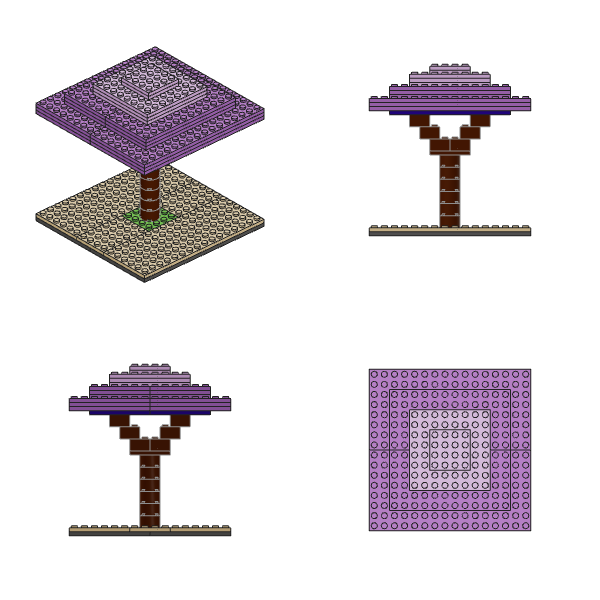
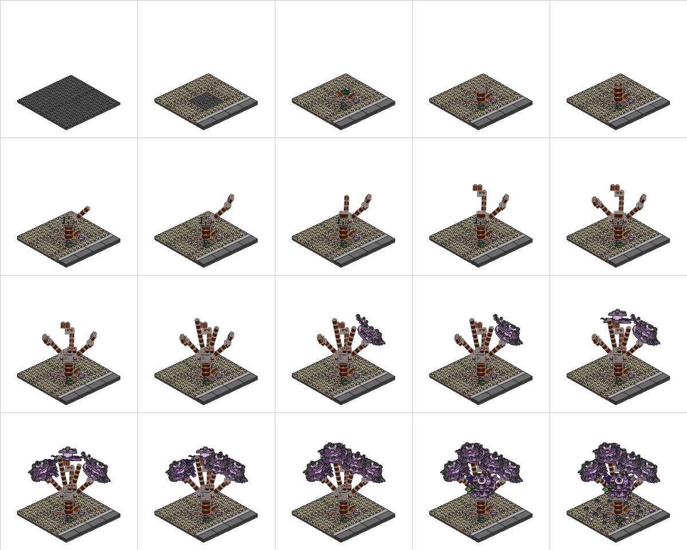

# Ficha — Jacarandá porteño en flor

## 1. Especie, escala y rasgos

**Especie elegida: jacarandá (*Jacaranda mimosifolia*), el de las veredas y plazas de Buenos Aires en noviembre.**

Por qué:

- **Forma.** De grande tiene la copa extendida o en paraguas: un tronco corto que se abre en pocas ramas gruesas en vaso y una copa más ancha que alta, abierta y con huecos de cielo. Según los hechos, es la forma que la gente prefiere (acacia/sabana, Sommer y Summit) y la que más alegría da (Lohr y Pearson-Mims 2006). Además, "tronco + paraguas" es la silueta de árbol más clara que hay, así que se reconoce aunque no sepas qué especie es.
- **Color.** Florece casi sin hojas y la copa se pone entera lila azulada. Pasa a ser un árbol que no se confunde con otro, y el lila se ve poco en un video de ladrillos.
- **Historia para el video.** Es de los pocos árboles cuya floración se lee como un evento: en invierno queda la estructura desnuda, en primavera explota lila y el suelo queda alfombrado. El armado cuenta eso mismo: ramas desnudas primero, flor después y, al final, las flores caídas.
- **Piezas.** Las piezas chicas de flor y de hoja salieron de verdad en tres lilas: Medium Lilac (oscuro, azulado), Medium Lavender (medio) y Lavender (claro). Con eso la copa tiene luz y sombra.

**Escala: aprox. 1:80 (la de un tren H0).**

- **Árbol:** mide 13,6 cm desde la vereda, que a esa escala son ~10,8 m, lo típico de un jacarandá de calle.
- **Copa:** 16 studs (12,8 cm), unos 10 m de ancho.
- **Horqueta:** está a 3,2 cm de la vereda (~2,6 m), un 24 % de la altura total.
- **Tronco:** 2 × 2 studs, 1,6 cm, que serían ~1,3 m de diámetro. Es más grueso que uno real (50–80 cm) a propósito: así se lee a 64 px y sostiene la copa a la vista.
- **Base:** 16 × 16 studs, un pedazo de vereda porteña de ~10 m con su cazuela, el cordón y un poco de calle.

**Rasgos que, si faltan, dejan de leerse como jacarandá:**

1. **El paraguas.** La copa es bastante más ancha que alta y chata arriba, y está sostenida por un tronco corto que se abre en ramas en vaso, visibles por debajo. Si es redonda o cónica, es "un árbol cualquiera".
2. **El lila cubriendo la copa, con muy poco verde.** Sin el lila no hay jacarandá. Tiene que tener tres tonos, porque con uno solo parece un bloque.
3. **La alfombra lila en el suelo.** Las flores caídas sobre la vereda, alrededor de la cazuela, son la firma porteña de noviembre.

## 2. Tres conceptos

**A. "Jacarandá de vereda en noviembre".**

- **Silueta:** paraguas ancho (16 studs) sobre tronco corto que se bifurca en ramas en vaso.
- **Paleta:** tronco marrón; copa en tres lilas con apenas algún verde claro; vereda de "baldosas de vainilla" (studs expuestos) con cazuela y flores caídas.
- **Sub-armados:** vereda y cazuela; tronco con raíces; ramas; racimos de flor.
- **Revelación:** el árbol se arma desnudo, como en invierno, y "florece" en los últimos pasos. Racimo por racimo, la copa lila tapa las ramas.

**B. "Sauce llorón en la orilla".**

- **Silueta:** copa llorona, con ramas que caen hasta casi tocar el agua.
- **Técnica:** las cortinas son "Plant Sea Grass" (30093) dadas vuelta y colgadas de la copa.
- **Paleta:** verdes (Bright Green, Lime, Green), tronco Reddish Brown y un estanque de tiles trans.
- **Sub-armados:** orilla, tronco inclinado, cúpula, cortinas.
- **Revelación:** se cuelgan las cortinas al final y la silueta pasa de hongo a sauce.

**C. "Pehuén (araucaria) patagónico".**

- **Silueta:** fuste alto, recto y desnudo, con pisos de ramas horizontales que se curvan hacia arriba en la punta (modelo de Massart) y un paraguas arriba.
- **Paleta:** Dark Green, tronco Reddish Brown y rocas grises.
- **Sub-armados:** roca, fuste y un piso de ramas repetido.
- **Revelación:** el último piso cierra el paraguas.

**Elijo A.**

- **Silueta.** Tiene la silueta más reconocible de las tres: tronco visible más copa extendida. El sauce, a 64 px, puede leerse como un hongo o una medusa, y el pehuén es poco conocido fuera de la Patagonia.
- **Belleza.** Es la más linda: el lila sobre la vereda cálida da contraste de complementarios y se ve poco.
- **Video.** El armado tiene una narrativa natural (del invierno a la floración) que respeta "la revelación al final".
- **Espacio.** La copa extendida entra bien en un video vertical porque el tronco le da altura.

## 3. Boceto

Forma general con piezas simples (45 piezas, valida sin errores):

- **Base:** dos placas 8 × 16 y una capa tan con la cazuela.
- **Tronco:** seis ladrillos redondos 2 × 2.
- **Ramas:** cuatro, en escalera de ladrillos 2 × 2.
- **Copa:** placas escalonadas (12 × 12, 16 × 16, 8 × 8).

Silueta a 64 px: `renders/boceto-silueta-64.png`.

Qué me dijo:

- **De frente y de costado ya es un árbol.** Aun a 64 px se lee como un árbol de copa en paraguas.
- **En 3/4 es una mesa.** La cámara está alta: la copa plana tapa el tronco y se ve como dos losas apiladas. La copa necesita volumen, bordes irregulares y huecos.
- **Tronco y ramas.** El tronco era largo; las ramas en escalera se leían, pero como bloques.

## 4. Pasada de elementos (sub-armado por sub-armado)

Cada sub-armado se validó con `--sub` al cerrarlo; hoy los nueve pasan sin errores.

- **vereda (17 piezas).**
  - **Calle:** tiles 2 × 4 Dark Bluish Grey.
  - **Cordón:** tiles 1 × 8 Light Bluish Grey.
  - **Vereda:** placas tan con los studs a la vista.
  - **Cazuela:** un hueco 6 × 6 en el centro.
- **tronco (13).**
  - **Tierra:** placa 6 × 6 Dark Brown que entra en la cazuela.
  - **Ensanche de la base:** cuatro raíces de pendiente curva 2 × 1 en molinete.
  - **Detalles:** dos matas de pasto y dos flores caídas.
  - **Tronco:** tres ladrillos redondos 2 × 2.
  - **Pivote:** una placa redonda 2 × 2 con un único stud central.
- **ramas (50).**
  - **Horqueta:** placa redonda 4 × 4 Dark Brown, montada sobre el pivote y girada 45°, así las ramas salen hacia las diagonales de la base.
  - **Seis ramas.** Cada una lleva una bisagra de ladrillo (3937 + 3938) inclinada 40–46° y un tramo de ladrillos redondos 1 × 1. Después, un codo (otra bisagra) la endereza a 26–32°, y termina en una punta de ladrillo "log" 1 × 2, con corteza.
  - **Ramas centrales:** dos, casi verticales, sin codo.
- **flor-n, flor-e, flor-s, flor-w, flor-cn, flor-cs (21–22 cada una).** Un pompón de flor por punta de rama, de abajo hacia arriba:
  - Placa redonda 6 × 6 "con agujero".
  - Anillo de flores 1 × 1 de cinco pétalos, hojitas de tres hojas y, en algunos, un fleco (Plant Leaves 4 × 3, que en lila parece una panícula).
  - Separador redondo 2 × 2 y placa redonda 4 × 4 con flores.
  - Tope redondo con una flor.
- **Epílogo (20 piezas en el modelo principal).** Flores y pétalos (tile 1 × 1 cuarto de círculo) caídos sobre la vereda.

**Usos ingeniosos de piezas:**

1. **Bisagras de ladrillo como articulaciones de rama.** La rama se arma derecha y queda en S: la primera bisagra la abre en vaso y el codo le levanta la punta, como una rama que busca la luz. Con piezas del sistema se logran ángulos libres, sin piezas de árbol.
2. **Pompón balanceado en un solo stud.** La placa redonda 6 × 6 "con agujero" encastra en un único stud por el agujero del centro, así que el pompón entero se puede girar lo que haga falta. Lo giré −45° para que quede alineado con la base aunque la rama llegue en diagonal, y la copa entra justo en 16 × 16. El mismo truco (placa redonda con un stud al centro) permite girar la horqueta 45° sobre el tronco.
3. **Studs expuestos como "vainillas".** En la vereda los studs a la vista no son "falta de terminación": son las vainillas de la baldosa porteña.
4. **Flecos y hojitas ubicados por geometría.** El script mira hacia dónde apunta cada stud del anillo en el mundo:
   - hacia el borde de la base, solo flores (no sobresalen);
   - hacia el hueco con el pompón vecino, un fleco y hojitas (lo rellenan);
   - hacia el tronco, nada;
   - si la punta de una hoja rozaría a otro pompón, va una flor.

## 5. Refinamiento (lo que probé y por qué quedó así)

- **Copa.**
  - **Descartes.** Las hojas 6 × 5 (2417) en este render se ven como copos de nieve. Los platos radar, los domos y el ladrillo redondo 4 × 4 liso parecen objetos (tortas, platos voladores), no follaje.
  - **Pompones.** Ganaron los de placas redondas cubiertas de flores y hojitas. Pasaron a ser de dos pisos, con separador, porque en una sola capa se veían como discos finos.
- **Ramas.**
  - **Troncos 1 × 2.** Se leían como una cuña marrón maciza. Los ladrillos redondos 1 × 1 dan ramas finas y separadas.
  - **Inclinación.** Probé inclinaciones de 18° a 48° y largos distintos para las ramas centrales hasta que ninguna atraviesa a otra y el domo no tiene muesca arriba.
- **Proporción.** Acorté el tronco de 5 a 3 ladrillos: la horqueta quedó al 24 % de la altura y la copa domina, como en un jacarandá de calle.
- **Huella.** Con los flecos hacia afuera la copa medía 18,6 studs. Con los pompones alineados y la regla de flores hacia el borde, mide exactamente 16 × 16.
- **Paleta.**
  - **Copa:** Medium Lavender dominante y flores Lavender; pocas hojitas Medium Lilac como sombra, porque con más la copa se volvía azul. Tres hojitas Bright Green como brotes nuevos: el jacarandá florece casi sin hojas.
  - **Madera:** tronco y ramas Reddish Brown; horqueta y tierra Dark Brown.
  - **Base:** vereda Tan, cordón Light Bluish Grey y calle Dark Bluish Grey.
  - **Descarte:** el ladrillo redondo con rejilla, como corteza, se veía como una faja de metal.
- **Roces.** Moví piezas hasta dejar solo dos roces leves (1,2 y 1,6 LDU) entre bisagras vecinas de la horqueta.
- **64 px.** La silueta es de árbol en las tres vistas laterales y el color lila se lee (`renders/final-silueta-64.png`).

## 6. Armado (20 pasos del video)

| Paso | Qué entra | Por qué ahí |
|---|---|---|
| 1 | Dos placas 8 × 16 gris oscuro: el suelo | Arranque tranquilo |
| 2 | La vereda: calle, cordón y "baldosas de vainilla"; queda el hueco de la cazuela | Se reconoce el lugar |
| 3 | Tierra de la cazuela con 4 raíces, pasto y dos flores caídas | Primer marrón; ensanche de la base |
| 4 | Dos ladrillos redondos: el tronco sale de la tierra | |
| 5 | Tercer ladrillo y el pivote de un solo stud | |
| 6 | Horqueta girada 45° y primera rama: bisagra y tramo inclinado | Empieza el tramo técnico |
| 7 | Codo de la primera rama y su punta | Se ve cómo se dobla una rama |
| 8–9 | Segunda rama, en dos pasos | Se repite para fijarlo |
| 10–11 | Tercera y cuarta rama, enteras | Grupo repetido: ya se agrupa |
| 12 | Las dos ramas centrales: **árbol desnudo (invierno)** | Momento de pausa |
| 13 | Primer pompón: placa redonda y anillo de flores y hojitas | Primer lila; se muestra entero |
| 14 | Primer pompón: separador, segundo piso y flor de arriba | |
| 15–18 | Pompones de atrás, del costado y los dos centrales, uno por paso | Ritmo rápido; la copa se llena de atrás hacia adelante |
| 19 | **El pompón de adelante cierra la copa, de cara a la cámara** | Revelación |
| 20 | **Caen las flores sobre la vereda** | Epílogo: la alfombra lila |

- **Visibilidad.** Cada paso agrega piezas visibles desde la vista 3/4, y los pompones van de atrás hacia adelante para que ninguno tape al siguiente.
- **Silueta.** Los 20 cambian la silueta de frente: mínimo 1 %, medio 5 % y ningún paso invisible.
- **Ritmo.** Arranque tranquilo (1–5), tramo técnico de bisagras (6–12), un paso lento de detalle (13–14), floración rápida (15–19) y remate (20).
- **Cómo lo resolví en el archivo.**
  - **Un sub-armado por paso.** Hay un sub-armado por paso del modelo principal, porque si un paso trae dos, el visor funde el último paso de uno con el primero del otro.
  - **Epílogo al final.** El visor muestra primero todos los pasos de los sub-armados y después los del principal, así que el epílogo va en un paso final del principal que solo tiene piezas.
  - **Pasos que no suman cuadros.** Los otros pasos del principal solo colocan sub-armados y no agregan cuadros nuevos. Por eso el archivo tiene 29 pasos y el video, 20 cuadros.

## 7. Números finales

| | |
|---|---|
| Piezas | 228 (entre 60 y 250) |
| Sub-armados | 9: vereda, tronco, ramas y seis pompones |
| Validación | 0 errores; 2 avisos (roce ≤ 1,6 LDU entre bisagras vecinas). Cada sub-armado valida solo. |
| Huella y alto | 16 × 16 studs × 14,8 ladrillos |
| Colores | 10 |
| Pasos del video | 20 (0 invisibles; cambio de silueta medio 0,05) |
| Dimensión fractal de la silueta | 1,17 |

Todas las piezas y los colores salieron en sets: `validar` no marca combinaciones no vistas. No hay piezas "Plant Tree": la copa es de placas redondas, flores 1 × 1, hojitas 1 × 1 y hojas 4 × 3.

## 8. Cierre

**Qué salió bien**

- **Se reconoce al instante.** Tronco corto, horqueta en vaso, copa ancha y lila, y la vereda con flores caídas. A 64 px sigue siendo un árbol y en color, uno lila.
- **El armado cuenta una historia.** Suelo, árbol desnudo, floración y caída de flores. Todos los pasos cambian la silueta y el más llamativo va al final.
- **La técnica de las ramas.** Bisagras de ladrillo con codo (ramas en S que se arman derechas) y dos piezas redondas "sobre un solo stud" que dejan girar la horqueta y los pompones sin salirse de la grilla ni de la huella.
- **La base.** Es parte del modelo y cuenta el lugar: calle, cordón, vainillas y cazuela.
- **Todo valida.** El modelo completo y cada sub-armado por separado, con 228 piezas.

**Qué no me convence**

- **Pompones.** Son bastante redondos y ordenados, un poco "pompón de torta"; una copa real de jacarandá es más aireada e irregular. La dimensión fractal de la silueta (1,17) quedó por debajo de la franja preferida (1,3–1,5). Probé hojas 6 × 5 (se ven como copos de nieve) y panículas erguidas arriba de los pompones (parecen antenas), y no las usé.
- **Ramas centrales.** En el paso del árbol desnudo se ven como dos palos rectos.
- **Paso 2.** Pone toda la vereda de una vez (15 piezas, varias grandes). Separarla deja un paso invisible, porque todo está a la misma altura.
- **Piezas por coordenada.** Las flores del epílogo están en el modelo principal y se ubican por coordenada de stud, no por encastre: el DSL solo encastra dentro de un mismo sub-armado. Las piezas de las ramas también se ubican por coordenada, aunque calculada: se encastran en un borrador y se trasplantan.
- **Horqueta.** Quedan dos roces leves entre bisagras vecinas.
- **Tronco.** Es liso y más grueso que el real.

**Forma de copa según la tabla de `consigna/hechos-arbol.md`:** **Extendida**, mucho más ancha que alta, un domo bajo y amplio (copa de 16 studs de ancho por ~7,7 ladrillos de alto, ≈ 1,7 : 1). La sostiene un esqueleto **en vaso**: ramas que salen de un tronco corto y se abren hacia arriba y afuera. El crecimiento es decurrente, sin un eje que domine.

## Notas técnicas (para la próxima)

- **`giro` es absoluto.** Con `conector` (y también con `sobre`), `giro` se mide respecto del eje del conector en el mundo, no respecto de la pieza base. Sobre una pieza girada, `sobre` no hereda el giro.
- **Bisagra 3937/3938 y codos.** Con giro negativo, lo que va encima choca con la base. Para un codo que endereza la rama, se gira 180° la base del codo y se usa `180 − θ`.
- **Métricas y piezas rotadas.** Miden la caja de cada pieza rotada; un disco 6 × 6 girado 45° "mide" 8,5 studs. Alinear las piezas redondas con la grilla ahorra huella.
- **Ramas y `--sub`.** Una rama inclinada suelta falla `--sub` ("se vuelca"). Con la horqueta en el mismo sub-armado, se para sola.
